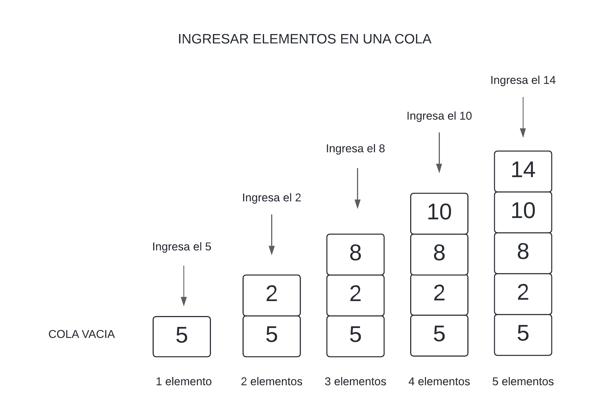

<div align="right">

</div>

# TDA LISTA

# IMPLEMENTACIÓN DE LISTA, PILA Y COLA, Y SU USO PARA LISTAR POKEMONES.

## Alumno: Juan Ernesto Juarez Lezama - 110418 - jjuarez@fi.uba.ar

- Para compilar:

```bash
gcc -g tp_lista.c src/lista.c src/csv.c src/split.c -o tp_lista
```

- Para ejecutar:

```bash
./tp_lista pokedex.csv
```

- Para ejecutar con valgrind:
```bash
valgrind ./tp_lista pokedex.csv
```

---

##  Funcionamiento

Para este TP, implementamos el TDA Lista. Esta estructura vivirá en el heap y sus elementos serán las direcciones originales que del valor que tengan las variables. Ejemplo: Digamos que tenemos un `int número = 5`, lo que la lista guardará, será la dirección de memeoria de número, o sea `&número`.

<div align="center">

</div>

El flujo del programa abrirá el archivo que se pase al ejecutar el programa, que en nuestro caso es el `pokedex.csv`. Luego se creará un una lista, la cual llamaremos `lista_pokemones`, la cuál almacenará los `struct pokemon`, dicha estructura estará creada en el heap, o sea, tendrémos las direcciones de memoria de los `malloc()`, y es bueno saber eso, porque debido a eso, no podemos hacer `free()` antes de tiempo, porque la lista, al tener direcciones de memoria originales, se deben liberar una vez que destruyamos la lista.

La lista tiene este estilo al almacenar 3 pokemones:

<div align="center">

</div>

Como vemos en la imagen, casi todo vive en el heap, por eso, en la función destructura, aparte de liberar los nodos, debemos liberar tanto el nombre de cada pokemon, como la estructura `Pokemon`:

```c
void destruir_pokemones(void *_pokemon)
{
	Pokemon *pokemon = (Pokemon*)_pokemon;
	free(pokemon->nombre);
	free(pokemon);
}


lista_destruir_todo(lista_pokemones, destruir_pokemones);
```

Aparte de usar una `Lista`, que es una estructura de datos, decidí crear una estructura llamada `Texto`, que almacenará, de forma dinamica, el texto ingresado por el usuario. Así no tengo un vector estático que puede almacenar hasta x caracteres y no romper el programa.

```c
typedef struct texto {
	char* texto_almacenado;
	size_t tamaño_del_texto;
	size_t capacidad;
} Texto;
```
En `texto_almacenado` almacenaremos cada caracter que sea ingresado por `stdin`, y vamos a colocarlo en cada posicion, y de eso dependerá `tamaño_del_texto`, ya que haciendo `texto_almacenado[tamaño_del_texto] = caracteres`, estamos dandole esa posicion, y al final de dar todos los caracteres, obtendremos la longitud total del texto.

<div align="center">

</div>


---

## Respuestas a las preguntas teóricas

## ¿Qué es una lista/pila/cola? Explicar con diagramas.

Tanto la lista, pila y cola son Estructuras que almacenan datos, ahora explicaré que es cada una y sus similitudes y diferencias.

### 1) Pila:  
La Pila tiene la estructura de que, cuando agreguemos elementos, se van a ir posicionando "uno encima del otro", pero cuando querramos sacar un elemento, siempre vamos a retirar el último que hayamos ingresado.  
Ejemplo: Queremos ingresa en una Pila los numeros 5, 2, 8, 10, 14.
La manera de ingresa primero sería el 5, luego le sigue el 2, luego el 8 ... hasta el 14. Entonces tendríamos nuestra pila con 5 elementos, como se muestra en la imagen:

<div align="center">

</div>

La manera en la que quitaremos cada elemento, siempre será el último que ingresamos. Como el número 14 fue el último que ingresamos, es el que está en el tope. Luego de sacar el 14, hay un nuevo tope, que es el número 10, entonces el próximo en salir es el 10, y así succesivamente hasta vaciar la pila.

<div align="center">

</div>

### 2) Cola:  
La manera de ingresar elementos, es similar a la Pila, "uno encima del otro", aunque esto es subjetivo. Tomando el mismo ejemplo de números, al igual que la pila, vamos a estar ecolando primero el 5, luego el 2, ... hasta el 14:

<div align="center">

</div>

La manera en la que vaciaremos la cola, ya no será como antes, que sacabamos el último que ingresaba, ahora, el primero en salir, siempre será el primero elemento que ingresamos. Como sabemos, primero ingresamos el 5, entonces ese será el primero en salir, luego saldrá el 2 ... y así hasta que salga el 14 y la cola quede vacía.

<div align="center">

</div>


### 3) Lista:
La lista, es un tipo de dato distinto, no hay una única manera de ingresar elemento, para la lista, se puede ingresar tanto al inicio, al final, y también en medio de la lista. Aquí usamos el concepto de posiciones. En la pila y cola no podemos acceder a alguna posición, que no sea sacando elementos. Con el mismo ejemplo de los números, siempre vamos a ingresar en el mismo orden, primero el 5, luego el 2 ... hasta el 14, pero la diferencia es que puede varias las posiciones en las que ingresarán los números:

<div align="center">

</div>

Teniendo la lógica de que, se puede ingresar elementos en cualquier posición de la lista, también podemos sacar elementos de la lista y dejarla vacía, retirando elementos en cualquier posicion:

<div align="center">

</div>

 ## Explica y analiza las diferencias de complejidad entre las implementaciones de lista simplemente enlazada, doblemente enlazada y vector dinámico para las operaciones  

### 1) lista simplemente enlazada:  
Una lista simplemente enlazada, en su estructura interna de nodos, habrá solo una dirección para recorrer la lista. El caso general es cuando el direccionamiento de los nodos va de inicio a final.

`Insertar/obtener/eliminar al inicio:`  
Insertar un elemento al inicio: cuando es la inicio, siempre será O(1), ya que es instantaneo, no hay que recorrer ningún elemento, siendo esta lógica, obtener y eliminar también serán O(1), (siendo que al eliminar el inicio, su nuevo inicio será el siguiente, el cual ya apunta).

`Insertar/obtener/eliminar al final:`  
Insertar un elemento al final, dependiendo como sea la estructura de la lista, puede ser O(1) si es que tenemos un puntero que apunte al final de la lista, caso contrario O(n), porque recorrerá toda la lista, para poder encontrar el final. Obtener elemento seguirá la misma lógica que insertar al final, si ya sé donde acaba, es O(1), si no, O(n). En el caso de eliminar elemento, en cualquiera de las 2 opciones, siempre será O(n), porque: Si sabemos donde acaba el final, lo eliminamos, pero debemos saber cuál es el elemento anterior al final, y como no sabemos cuál es (ya que los nodos solo apuntan en una dirección), debemos iterar hasta encontrar el penúltimo nodo (debemos iterar hasta encontrar ese nodo conociendo la cantidad de elementos) antes de eliminar el último y lo mismo sería si no sabemos el puntero al final, ya que, como no nos importa que haya un final (puntero), entonces es ir recorriendo la lista, llegar al final y eliminarlo.  

`Insertar/obtener/eliminar al medio:`  
Insertar al medio: Con cualquiera de las 2 posibles estructuras de una lista, conociendo el puntero al final d ela lista, la manera de agregar, buscar y eliminar un elemento, será O(n), porque vamos a tener que recorrer la lista.  

### 2) Lista doblemente enlazada:  
En esta implementación, cada nodo tendrá doble direccionamiento, tanto al siguiente nodo como al nodo anterior.  

`Insertar/obtener/eliminar al inicio:`  
Siguiendo la mismoa lógica de la estructura anterior todo eso es O(1), ya que no hay que ir a buscar nada.  

`Insertar/obtener/eliminar al final:`  
Aquí sí cambia con el anterior, primero mencionar que insertar sigue siendo O(1) al igual que obtener, pero eliminar, ya no es O(n), porque al ser doblemente enlazada, tenemos direccion al nodo anteior, entonces no tenemos que iterar.  

`Insertar/obtener/eliminar al medio:`  
Insertar, buscar y eliminar al medio, siguen siendo O(n), ya que debemos iterar.  

### 3) Vector dinámico:  
Al ser un vector, tiene memoria contigua, sabremos las posiciones, aparte de saber la cantidad de elementos, en esta estructura, deseo decir que, aparte de conocer la cantidad de elementos, tambien deseo saber donde inicia mi vector.  

`Insertar/obtener/eliminar al inicio:`
Insertar ya no es O(1) como en la simplementa o doblemente enlazada, esta vez, el primero elemento debe ser el primer bloque del vector, entonces para posicionar el inicio, debo mandar a la derecha y seder el espacio para el nuevo elemento, tanto eliminar y obtener serían O(1), ya que solo me basta con tener una lógica interna que, cuando borre el el primero, el usuario ingrese la posicion [0], seria darle lo que está en la posicion [1] (lo cual es O(1)), ignora la posicion [0], ya que, aunque está el elemento en el vector, el usuario ya lo eliminó.  

`Insertar/obtener/eliminar al final:`  
Insertar al final es O(1), ya que sabemos la cantidad de elementos, al igual que obtener es O(1). Eliminar también es O(1), porque no le damos acceso a ese elemento, aunque esté en el vector, insertar es O(1), ya que reemplazamos aquellos que borramos, y siempre que agregamos, no tenemos que mover nada a ningún lado, no como insertar al inicio, ya que, si no habia lugar a "izquierda" (en direccion al inicio), se demen mover los elementos.  

`Insertar/obtener/eliminar al medio:`  
Aquí es distinto, insertar en el medio, porque, aunque sea directo darle la posicion donde quiero agegar, debo mover a la derecha para darle espacio a mi nuevo elemento. Obtener seria O(1), y eliminar sería O(n), ya que debo hacer que el lado derecho, vaya para la izquierda y "rellenar" ese bloque.  

 ## Explica la complejidad de las operaciones implementadas en tu trabajo para la pila y la cola.  

Aquí, para ahorrar espacio, las operaciones para la Pila y Cola son casi las mismas, solo varian distintos parámetros para las funciones de la lista, ya que estamos reutilizando las funciones de Lista, por eso, todas las funciones dependerán de la Lista.

### `pila_crear` y `cola_crear` O(1)
Al ser una inicialización de las estructuras Pila/Cola es `O(1)`, también vamos a inicializar la estructura de Lista, lo cual conlleva a `malloc()` y asignaciones de punteros a NULL en la Lista y la cantidad de elementos inicializada en 0, cosa que todo es `O(1)`.

```c
struct pila {
	Lista *elementos;
};
```

### `pila_cantidad` y `cola_cantidad` O(1)
Como llevamos un contador en la implementación de la estructura Lista, saber la cantidad de elementos es `O(1)`, porque no tenemos que recorrer la lista para saber cuántos elementos hay, eso sería `O(n)`.

```c
return lista_cantidad_elementos(cola->elementos);
```

### `pila_apilar` y `cola_encolar` O(1)
La manera de agregar elementos, es distinto en cada caso. Para la Pila, agregar elemento siempre será al inicio de la lista, mientras que en la Cola, será al final. Tanto agregar al inicio como agregar al final son O(1), porque la estructura de Lista hay puntero a esos 2 nodos, por lo cual no tenemos que recorrer nada para poder almacenar en esos casos.

```c
struct lista {
	struct nodo *primer_nodo;
	struct nodo *ultimo_nodo;
	size_t cantidad_elementos;
};
```
### `pila_desapilar` y `cola_desencolar` O(1)
Aquí explico por qué decidí que se apilen y encolen de distintas maneras. Para que la función de desapilar y enconlar sean `O(1)`, necesito que sea en un lugar donde sea al sin la necesidad de iterar. Uno pensaría que eliminar al final seríá factible, pero no lo es, porque una vez que sacamos el último nodo, debemos asignar un nuevo nodo, y como no sabemos qué hasya atrás de nosotros (por ser lsita simplementa enlazada), debemos iterar hasta encontrar ese nuevo último nodo (el nodo anterior al último que saqué), por esa razón, es que la única posición donde puedo hacer que sea `O(1)` es en la posicion 0, el inicio, porque una vez que quito ese nodo, asigno el nuevo inicio al siguiente nodo donde apunta. De eso, va a dependender cómo agrego los elementos para que sean una pila y una cola. En la cola agrego al inicio para que el primero en sacar sea el último que ingresé, y en la cola, al agregar por el final de la lista, siempre quitaré el primer elemento que ingresé a la lista. Cabe resaltar que la función de `lista_agregar_elemento` es `O(n)`, pero como siempre agregarémos en la primera posición, no hay otros casos posibles, por eso es que es `O(1)`, ya que aquí no se cuenta el peor de los casos (nunca cambia la posicion para agregar el elemento).

```c
#define INICIO 0;

bool pila_apilar(Pila *pila, void *cosa)
{
	return lista_agregar_elemento(pila->elementos, INICIO, cosa);
}
```
Nota: Pongo `define`, porque cuando hago `const size_t`, me aparecen errores, aunque le cambie de nombre en cola.c y pila.c


### `pila_tope` y `cola_frente` O(1)
Siguiendo con la lógica del punto anterior, cuando deseamos ver el tope o el frente, son los próximo elementos a salir, si es que decidimos retirarlos, por eso, la posicion es en el inicio, y como tenemos el puntero al inicio, visualizar el elemento es `O(1)`.

### `pila_esta_vacia` y `cola_esta_vacia` O(1)
Esta función verifique que, si la la estructura Lista tiene 0 elementos, significa que está vacía. Al ser un funciones lógicas, es `O(1)`.
```c
return cola_cantidad(cola) == 0;
```

### `pila_destruir` y `cola_destruir` O(n)
Cuando tengamos que destruir la pila o la cola, vamos a tener que pasar nodo por nodo y liberar el nodo. Eso cuesta O(n), ya que vamos a liberar los n nodos que haya.

### `pila_destruir_todo` y `cola_destruir_todo` O(n * g(h))
Así como en pila_destruir o cola_destruir, debemos liberar nodos, no necesariamente las direcciones que apunte los elementos están en el stack, también pueden estar en el heap, y aunque esté en el heap, si hacemos únicamente una función que haga `free()`, eso cuesta `O(1)`, con lo cual, nos queda `O(n * O(1))` -> `O(n)`, pero puede ser que en vez de solo guardar direcciones, guardemos estructuras complejdas como guardar una lista, liberar todo costaría O(n*m), siendo `n` la cantidad de elementos en la pila/cola y `m` siendo la cantidad de elementos dentro de la lista que está guardando el nodo, y esto es válido, ya que podemos guardar cualquier tipo de dato debido al `void*`.